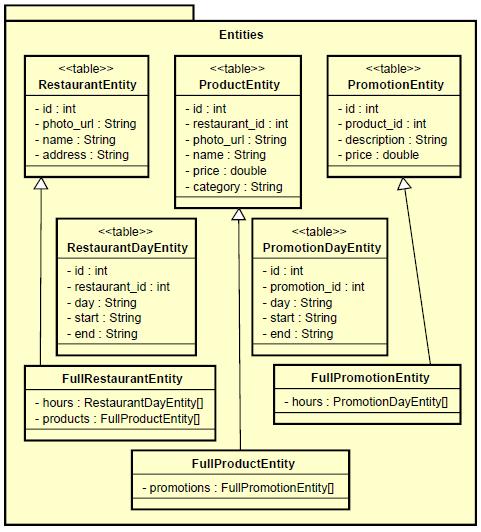
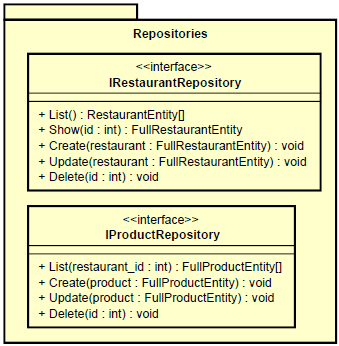
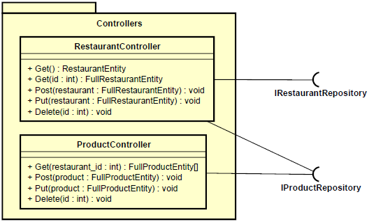

# Restaurant Manager API
RESTful API that can manage restaurants and menu products, developed in NodeJS with Typescript, integrated with a MySQL database.

## Features
* List restaurants
* Show restaurant's data
* Create restaurant
* Update restaurant
* Delete restaurant
* List products of a restaurant
* Create product of a restaurant
* Update product of a restaurant
* Delete product of a restaurant

## Architecture
This system was designed based on the layered architecture and has the following structure:
* Entity
  - 
* Repository
  - 
* Controller
  - 

## System requirements
  - Have the Node installed.
  - Access to a MySQL database.

## How to setup and run
- Clone project and setup:
  1. On the terminal, go to the folder you want to download the project
    ```shell
    cd {{ project_folder }}
    ```
  2. Clone the project:
    ```shell
    git clone https://github.com/aliffy-benevides/restaurants-manager-api.git
    ```
  3. Enter on project's folder:
    ```shell
    cd restaurants-manager-api\
    ```
  4. Install dependencies:
    ```shell
    npm i
    ```

- Run tests:
  ```shell
  npm test
  ```

- Run project in development mode:
  ```shell
  npm start
  ```

- Run project in production mode:
  1. Set the following environment variables in your operational system:
      - RESTAURANT_MANAGER_DB_HOST=127.0.0.1
      - RESTAURANT_MANAGER_DB_USER=your_database_user
      - RESTAURANT_MANAGER_DB_PASSWORD=your_database_password
      - RESTAURANT_MANAGER_DB_DATABASE=myapp_test
  2. Initialize production database
    ```shell
    npm run knex:migrate:prod
    ```
  3. Start production server, this script also create the production files on folder 'dist'
    ```shell
    npm run start:prod
    ```


## How to use
The following endpoints are available to use the API.
- **Restaurant endpoints**:
  - **List restaurants**
    List of all created restaurants.
    Return type: RestaurantEntity[].
    - Example:
      ```shell
      curl --request GET \
        --url {{ baseUrl }}/restaurants
      ```
  - **Show restaurant**
    Information about the restaurant specified by the parameter `id`.
    Return type: FullRestaurantEntity.
    - Example:
      ```shell
      curl --request GET \
        --url {{ baseUrl }}/restaurants/:id
      ```
  - **Create restaurant**
    Create a restaurant with the object received by body.
    Body type: FullRestaurantEntity in format JSON.
    Return type: void.
    - Example:
      ```shell
      curl --request POST \
        --url {{ baseUrl }}/restaurants \
        --header 'content-type: application/json' \
        --data '{
          "photo_url": "Photo url",
          "name": "Restaurant name",
          "address": "Restaurant address",
          "hours": [
            { "day": 1, "start": "08:00", "end": "17:00" },
            { "day": 2, "start": "08:00", "end": "17:00" }
          ]
        }'
      ```
  - **Update restaurant**
    Update the restaurant specified by the parameter `id` with the object received by body.
    Body type: FullRestaurantEntity in format JSON.
    Return type: void.
    - Example:
      ```shell
      curl --request PUT \
        --url {{ baseUrl }}/restaurants/:id \
        --header 'content-type: application/json' \
        --data '{
          "photo_url": "Photo url",
          "name": "Updated name",
          "address": "Restaurant address",
          "hours": [
            { "day": 1, "start": "08:00", "end": "17:00" },
            { "day": 2, "start": "08:00", "end": "17:00" }
          ]
        }'
      ```
  - **Delete restaurant**
    Delete the restaurant specified by the parameter `id`.
    Return type: void.
    - Example:
      ```shell
      curl --request DELETE \
        --url {{ baseUrl }}/restaurants/:id
      ```

- **Product endpoints**:
  - **List products**
    List of all created products of the restaurant specified by the parameter `restaurantId`.
    Return tpye: FullProductEntity[].
    - Example:
      ```shell
      curl --request GET \
        --url {{ baseUrl }}/restaurants/:restaurantId/products
      ```
  - **Create product**
    Create a product with the object received by body for the restaurant specified by parameter `restaurantId`.
    Body type: FullProductEntity in format JSON.
    Return type: void.
    - Example:
      ```shell
      curl --request POST \
        --url {{ baseUrl }}/restaurants/:restaurantId/products \
        --header 'content-type: application/json' \
        --data '{
          "photo_url": "Photo url",
          "name": "Product name",
          "price": 25.99,
          "category": "Product category",
          "promotions": [{
            "description": "Promotion description",
            "price": 19.99,
            "hours": [
              { "day": 1, "start": "08:00", "end": "17:00" },
              { "day": 2, "start": "08:00", "end": "17:00" }
            ]
          }]
        }'
      ```
  - **Update product**
    Update the product specified by the parameter `id` in the restaurant specified by the parameter `restaurantId` with the object received by body.
    Body type: FullProductEntity in format JSON.
    Return type: void.
    - Example:
      ```shell
      curl --request PUT \
        --url {{ baseUrl }}/restaurants/:restaurantId/products/:id \
        --header 'content-type: application/json' \
        --data '{
          "photo_url": "Photo url",
          "name": "Updated name",
          "price": 25.99,
          "category": "Product category",
          "promotions": [{
            "description": "Promotion description",
            "price": 19.99,
            "hours": [
              { "day": 1, "start": "08:00", "end": "17:00" },
              { "day": 2, "start": "08:00", "end": "17:00" }
            ]
          }]
        }'
      ```
  - **Delete product**
    Delete the product specified by the parameter `id` in the restaurant specified by the parameter `restaurantId`.
    Return type: void.
    - Example:
      ```shell
      curl --request DELETE \
        --url {{ baseUrl }}/restaurants/:restaurantId/products/:id
      ```

## Challenges and problems
  - **Photo upload**
    The application are just able to store the link of a photo already hosted. To improve it, can be added endpoints for photo uploading.
  - **Integration of knex with webpack**
    There is some problems to integrate the query builder knex and the module bundler webpack, including the problems to run migrations after build project. To solve that, it is necessary run the production database setup with development files, and also it is necessary to store the database credentials in the system environment variables.
