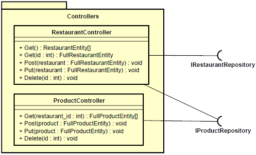

# Restaurant Manager API
RESTful API that can manage restaurants and menu products.

## Features
* List restaurants
* Show restaurant's data
* Create restaurant
* Update restaurant
* Delete restaurant
* List products of a restaurant
* Create product of a restaurant
* Update product of a restaurant
* Delete product of a restaurant

## Architecture
This system was designed based on the layered architecture and has the following structure:
* Entity
  
* Repository
  
* Controller
  

## How to use
The following endpoints are available to use the API.
- Restaurant endpoints:
  - <b>GET /restaurants</b>
    List of all created restaurants.
    Return tpye: RestaurantEntity[].
  - <b>GET /restaurants/:id</b>
    Information about the restaurant specified by the parameter `id`.
    Return type: FullRestaurantEntity.
  - <b>POST /restaurants</b>
    Create a restaurant with the object received by body.
    Body type: FullRestaurantEntity in format JSON.
    Return type: void.
  - <b>PUT /restaurants/:id</b>
    Update the restaurant specified by the parameter `id` with the object received by body.
    Body type: FullRestaurantEntity in format JSON.
    Return type: void.
  - <b>DELETE /restaurants/:id</b>
    Delete the restaurant specified by the parameter `id`.
    Return type: void.

- Product endpoints:
  - <b>GET /restaurants/:restaurantId/products</b>
    List of all created products of the restaurant specified by the parameter `restaurantId`.
    Return tpye: FullProductEntity[].
  - <b>POST /restaurants/:restaurantId/products</b>
    Create a product with the object received by body for the restaurant specified by parameter `restaurantId`.
    Body type: FullProductEntity in format JSON.
    Return type: void.
  - <b>PUT /restaurants/:restaurantId/products/:id</b>
    Update the product specified by the parameter `id` in the restaurant specified by the parameter `restaurantId` with the object received by body.
    Body type: FullProductEntity in format JSON.
    Return type: void.
  - <b>DELETE /restaurants/:restaurantId/products/:id</b>
    Delete the product specified by the parameter `id` in the restaurant specified by the parameter `restaurantId`.
    Return type: void.
  
## How to run